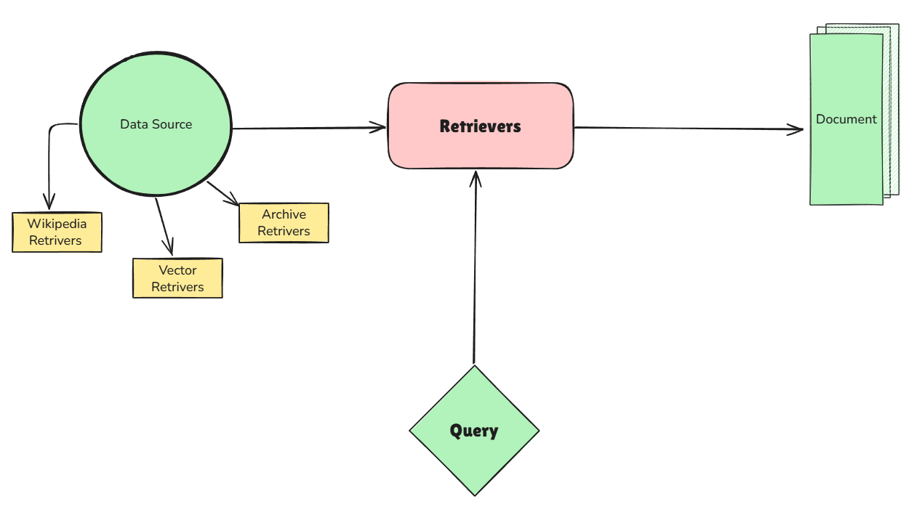

# Retivers in LangChain
## What is retrievers in langchain?
Retrievers are components in LangChain that help you fetch relevant documents or pieces of information from a larger dataset based on a query. They are essential for building applications that require information retrieval, such as question-answering systems, chatbots, and search engines.

## Types of Retrievers
LangChain provides several types of retrievers, each suited for different use cases:
1. **Vector Store Retrievers**: These retrievers use vector embeddings to find similar documents based on their semantic meaning. They are particularly useful for unstructured data like text, images, or audio.
2. **BM25 Retriever**: This is a traditional information retrieval algorithm that ranks documents based on their relevance to a query using term frequency and inverse document frequency.
3. **SQL Retriever**: This retriever allows you to query structured data stored in SQL databases.
4. **Custom Retrievers**: You can also create your own retrievers by implementing the `BaseRetriever` class.
5. **Wikipedia Retriever**: This retriever is specifically designed to fetch information from Wikipedia articles.
6. **Archive Retriever**: This retriever can extract information from archived documents or datasets.


## Data Scources
Retrievers can work with various data sources, including:
- Text files
- PDFs
- Databases
- Web pages
- APIs
- In-memory data structures

## Diagram of the retrivers in langchain



## Some of the Retrivers in LangChain

### 1. Wikipedia Retriever
The Wikipedia Retriever allows you to fetch information from Wikipedia articles. It can be used to answer questions based on the content of Wikipedia.

### How it works:
1. We give it a query (e.g., "What is the capital of France?").
2. It sends the query to the Wikipedia API.
3. It retrivers the ```most relevant articles```.
4. It returns them as LangChain ```Document``` objects.

### 2. Vector Store Retriever:
The Vector Store Retriever uses vector embeddings to find similar documents based on their semantic meaning. It is particularly useful for unstructured data like text, images, or audio.

### How it works:
1. We give it a query (e.g., "What is the capital of France?").
2. It converts the query into a vector using an embedding model.
3. It searches the vector store for documents with similar vectors.
4. It returns the most relevant documents as LangChain ```Document``` objects.