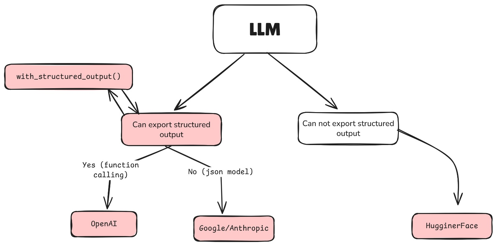

# Output Parsers in LangChain
Output parsers are a crucial component in LangChain, allowing users to convert the raw output from language models into structured data formats. This is particularly useful when working with complex data types or when the output needs to be processed further.

## Overview
Output parsers take the raw text output from a language model and transform it into a more usable format, such as JSON, dictionaries, or custom objects. This transformation is essential for applications that require structured data for further processing or analysis.

## Why Use Output Parsers?
- **Structured Data**: They help convert unstructured text into structured formats that can be easily manipulated and analyzed.
- **Error Handling**: They can include validation and error handling to ensure the output meets specific criteria.
- **Custom Formats**: They allow for the creation of custom output formats tailored to specific application needs.
## How to Use Output Parsers
To use output parsers in LangChain, you typically follow these steps:
1. **Choose an Output Parser**: Select an appropriate output parser based on your needs. LangChain provides several built-in parsers, such as `JSONOutputParser`, `DictOutputParser`, and more.
2. **Configure the Parser**: Set up the parser with any necessary parameters or configurations.
3. **Integrate with Language Model**: Use the output parser in conjunction with a language model to process the model's output.
4. **Parse the Output**: After the model generates output, pass it through the output parser to convert it into the desired format.
5. **Use the Parsed Output**: The structured output can now be used in your application, whether for display, storage, or further processing.


## Common Use Cases
- **Data Extraction**: Extracting specific information from unstructured text.
- **Structured Responses**: Converting model outputs into structured formats like JSON or dictionaries.
- **Custom Object Creation**: Creating instances of custom classes based on model outputs.

```mathematica
                 LangChain Structured Output
                           │
        ┌──────────────────┴──────────────────┐
        │                                     │
Use with `with_structured_output()`?       Alternative Approach
        │                                     │
        │                                     │
   ┌────┴─────┐                   ┌───────────┴───────────┐
   │          │                   │                       │
 Yes         No                  HuggingFace / Other     Text-only / Regex
   │          │                   Transformers            Parsing
   │          │                       │                       │
   │          │                       │                       │
   │   ❌ Not Supported            JSON Prompt +         Extract info from
   │   Raises NotImplementedError   json.loads()         raw text output
   │          │                       │                       │
   │          │                  Optional: Pydantic       Optional: Output
   │          │                  validation               parsers (StructuredOutputParser)
   │
Supported Models:
- OpenAI: gpt-4, gpt-4-32k, gpt-3.5-turbo
- Anthropic: claude-1, claude-2
- Mistral / APIs with function calling
```
## A short Diagram of Structured Output
