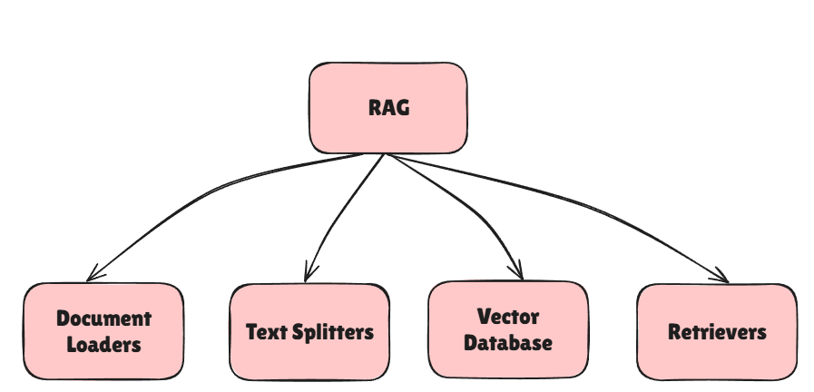
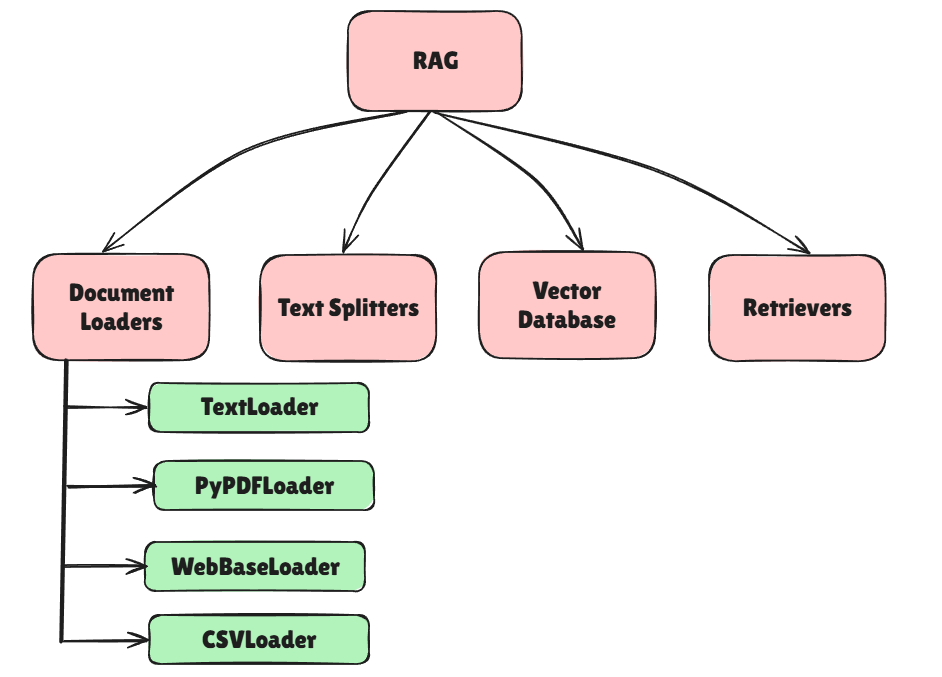

# Retrival Augmented Generation (RAG) with Document Loaders
Defination: RAG is a technique that combines retrieval of relevant documents with generative models to produce more accurate and contextually relevant responses. 
This approach is particularly useful in scenarios where the model needs to access a large knowledge base or specific documents to answer queries effectively.

## Benefits of using RAG
1. Use of up-to-date information
2. Better privacy
3. No limit of document size

## T  extLoaders
TextLoaders are components that facilitate the loading and processing of text data from various sources. They are essential in RAG systems for ingesting documents that will be used for retrieval and generation tasks.

## RAG Components

## RAG Docuement Loaders

